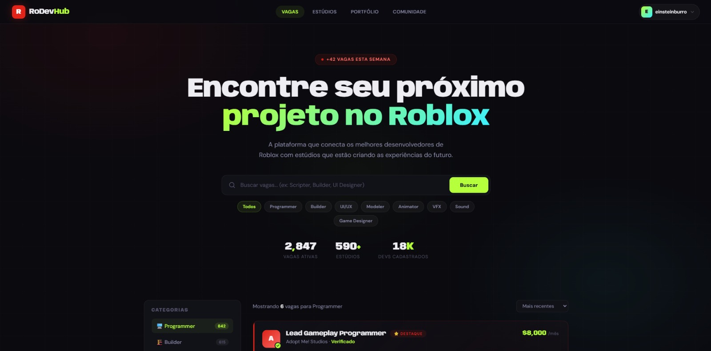

<div align="center">

#  RoDevHub

**Where Roblox developers connect, showcase their work, and find opportunities.**



[](https://spring.io/projects/spring-boot)
[](https://react.dev)
[](https://www.postgresql.org)
[](LICENSE)

</div>

---

##  About

RoDevHub is a professional networking platform built specifically for the Roblox developer community. Think of it as LinkedIn, but tailored for game devs — a space to build your portfolio, connect with other developers, discover job opportunities, and find studios to collaborate with.

##  Features

- **Authentication** — Secure registration and login with JWT-based session management
- **Developer Profiles** — Showcase your username, tagline, bio, location, and social links
- **Skills & Expertise** — List your skills with proficiency levels so studios know what you bring
- **Project Portfolio** — Display your Roblox games with descriptions, roles, game links, and dev timeline
- **Community Feed** — A LinkedIn-style feed to stay connected with the community
- **Studio Discovery** — Browse and find studios looking for talent

##  Tech Stack

| Layer | Technologies |
|-------|-------------|
| **Backend** | Spring Boot, Spring Security, Spring Data JPA, JWT |
| **Frontend** | React, React Router, Context API |
| **Database** | PostgreSQL |
| **Tools** | Lombok, OAuth2 Client, Bean Validation |

##  Getting Started

### Prerequisites

- Java 17+
- Node.js 18+
- PostgreSQL 16+

### Backend

```bash
cd backend
# Set your environment variables
export DB_URL=jdbc:postgresql://localhost:5432/rodevhub
export DB_USERNAME=your_user
export DB_PASSWORD=your_password
export JWT_SECRET=your_secret_key

./mvnw spring-boot:run
```

### Frontend

```bash
cd frontend
npm install
npm run dev
```

The app will be available at `http://localhost:5173`.

## Project Structure

```
rodevhub/
├── backend/
│   └── src/main/java/
│       ├── config/         # Security & JWT configuration
│       ├── controller/     # REST API endpoints
│       ├── dto/            # Request/Response objects
│       ├── model/          # JPA entities
│       ├── repository/     # Data access layer
│       └── service/        # Business logic
├── frontend/
│   └── src/
│       ├── components/     # Reusable UI components
│       ├── context/        # Auth & global state
│       ├── pages/          # Route pages
│       └── services/       # API integration
└── README.md
```

##  Roadmap

- [ ] Real-time messaging between developers
- [ ] Studio management dashboard
- [ ] Advanced search & filters
- [ ] Notification system
- [ ] Roblox API integration for automatic game imports

##  Contributing

Contributions are welcome! Feel free to open an issue or submit a pull request.

##  License

This project is licensed under the MIT License — see the [LICENSE](LICENSE) file for details.

---

<div align="center">

Built with ❤️ for the Roblox dev community

</div>
